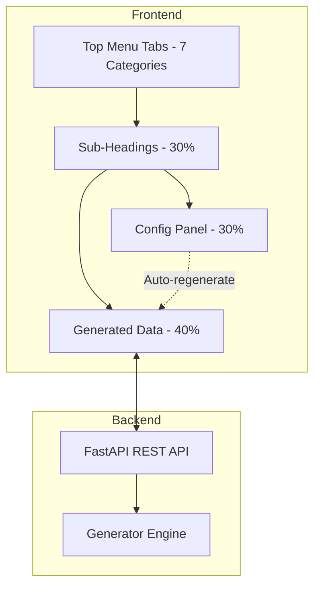
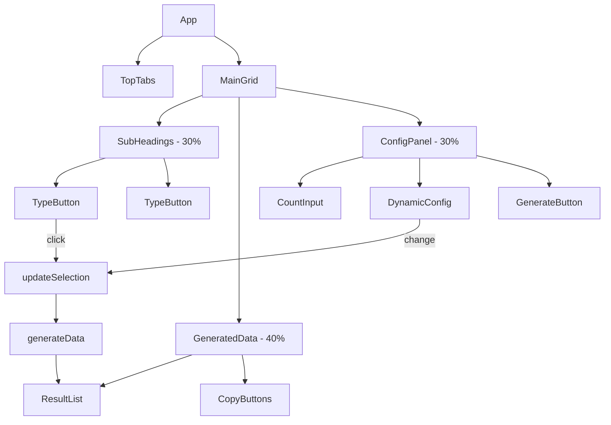

# Test Data Generator - UI & Behavior Implementation Plan

## Overview

This plan outlines the implementation of a complete UI redesign based on the detailed UI & Behavior Specification. The application will be restructured from a 2-column layout to a 3-column layout with 7 category tabs, organized sub-headings, and dynamic configuration panels.

---

## Architecture



---

## Category & Data Type Mapping

### 1. Identifiers & Security
| Type | Existing | Config Options |
|------|----------|----------------|
| UUID | ✅ | Prefix, Suffix |
| Password | ✅ | Uppercase, Lowercase, Numbers, Special chars, Length |
| Username | ✅ | Style selector, Prefix |
| IMEI | ✅ | Manufacturer dropdown (Apple/Samsung/Xiaomi/Generic), Valid checksum only |
| MAC Address | ✅ | Uppercase/Lowercase, Separator (:/-) |

### 2. Contact & Identity
| Type | Existing | Config Options |
|------|----------|----------------|
| Name | ✅ | Starts with, Ends with |
| Email | ✅ | Domain, Extension |
| Phone | ✅ | Country selector, Include/Exclude code |
| Address | ✅ | Country selector, Street patterns |
| Country | ✅ | Starts with |
| City | ✅ | Starts with or country-specific |
| ZIP Code | ✅ | Country rules or custom range (From/To/Length) |

### 3. Financial & Sensitive (FAKE DATA ONLY)
| Type | Existing | Config Options |
|------|----------|----------------|
| Credit Card | ✅ | Card variant (Visa/MasterCard/AmEx), Valid/Invalid toggle |
| SSN | ✅ | Country-based format |
| Barcode | ✅ | Numeric-only, Length selection |
| ISBN | ✅ | ISBN-10/ISBN-13 selector |

### 4. Network & Web
| Type | Existing | Config Options |
|------|----------|----------------|
| IP Address | ✅ | IPv4/IPv6 radio buttons |
| URL | ✅ | Domain variations, Extension, Protocol toggle |

### 5. Time & Text
| Type | Existing | Config Options |
|------|----------|----------------|
| DateTime | ✅ | Date (dd/mm/yyyy), Time (hh:mm:ss), Timezone (Z) checkboxes |
| Text | ✅ | Sentence (grammatically valid), Paragraph (variable length) |
| Sentence | ✅ | - |
| Paragraph | ✅ | - |

### 6. Colors
| Type | Existing | Config Options |
|------|----------|----------------|
| Hex Color | ✅ | Live preview, Uppercase/Lowercase |
| RGB Color | ✅ | Live preview, Range 0-255 |

### 7. Work & Organization
| Type | Existing | Config Options |
|------|----------|----------------|
| Company | ✅ | Starts with |
| Job Title | ✅ | Real-world titles, Seniority variations |

---

## UI Layout Structure

```
┌─────────────────────────────────────────────────────────────────────┐
│ 🔑 📞 💳 🌐 🕐 🎨 🏢  Top Menu Tabs (100% width)                    │
├──────────────────┬──────────────────────────┬──────────────────────┤
│                  │                          │                      │
│  Sub-Headings    │    Generated Data        │   Configuration      │
│                  │                          │                      │
│  [UUID]          │  ┌────────────────────┐  │  ┌────────────────┐  │
│  [Password]      │  │ 1. uuid_abc123     │  │  │ Count: [___]   │  │
│  [Username]      │  │ 2. uuid_def456     │  │  │                │  │
│  [IMEI]          │  │ 3. uuid_ghi789     │  │  │ Prefix: [___] │  │
│  [MAC Address]  │  │ ...                 │  │  │ Suffix: [___] │  │
│                  │  └────────────────────┘  │  │                │  │
│                  │                          │  │ [Generate]      │  │
│                  │  [Copy Raw] [JSON] [CSV]│  │                │  │
│                  │                          │  └────────────────┘  │
│                  │                          │                      │
│  30%             │        40%              │        30%           │
└──────────────────┴──────────────────────────┴──────────────────────┘
```

---

## Implementation Steps

### Phase 1: Backend API Updates

#### Step 1.1: Add Category Structure to main.py
```python
# New data structure
CATEGORIES = [
    {"id": "identifiers_security", "name": "Identifiers & Security", "icon": "🔑"},
    {"id": "contact_identity", "name": "Contact & Identity", "icon": "📞"},
    {"id": "financial_sensitive", "name": "Financial & Sensitive", "icon": "💳"},
    {"id": "network_web", "name": "Network & Web", "icon": "🌐"},
    {"id": "time_text", "name": "Time & Text", "icon": "🕐"},
    {"id": "colors", "name": "Colors", "icon": "🎨"},
    {"id": "work_org", "name": "Work & Organization", "icon": "🏢"},
]

# Updated DATA_TYPES with category mapping
DATA_TYPES = [
    {"type": "uuid", "name": "UUID", "icon": "🎲", "category": "identifiers_security", ...},
    {"type": "password", "name": "Password", "icon": "🔐", "category": "identifiers_security", ...},
    # ... all types with category mapping
]
```

#### Step 1.2: Add New API Endpoints
```
GET  /api/categories              - List all categories with types
GET  /api/categories/{id}/types    - Get types for a category
GET  /api/types/{type}/config     - Get config schema for a type
POST /api/generate                - Generate data (existing, enhanced)
```

#### Step 1.3: Enhance Generator Functions
- Add configuration validation per type
- Add checksum validation toggle for IMEI/CC
- Add case control for MAC/hex colors
- Add length/range validation for ZIP/barcode

### Phase 2: Frontend UI Redesign

#### Step 2.1: CSS Layout (index.html)
```css
/* 3-column grid layout */
.main-container {
    display: grid;
    grid-template-columns: 30% 40% 30%;
    gap: 20px;
    height: calc(100vh - 80px);
}

/* Top tabs */
.tabs-container {
    display: flex;
    width: 100%;
    background: white;
    border-radius: 16px 16px 0 0;
}

.tab-btn {
    flex: 1;
    padding: 16px;
    text-align: center;
    cursor: pointer;
    border-bottom: 3px solid transparent;
}

.tab-btn.active {
    border-bottom-color: #667eea;
}
```

#### Step 2.2: Sub-Headings Panel
```javascript
function renderSubHeadings(categoryId) {
    const types = dataTypes.filter(t => t.category === categoryId);
    // Render vertical list of type buttons
    // Click updates middle and right panels
}
```

#### Step 2.3: Generated Data Panel
```javascript
function renderResults(data) {
    // Render list with copy buttons
    // Support: Copy Raw, Copy as JSON, Copy as CSV
    // Click to copy individual items
    // Live color preview for colors
}
```

#### Step 2.4: Configuration Panel
```javascript
function renderConfig(type) {
    // Dynamic form based on type.config
    // Auto-regenerate on any config change
    // Generate button still available
}
```

### Phase 3: Copy & Export Functionality

#### Step 3.1: Copy Raw
```javascript
function copyRaw() {
    const text = results.map((r, i) => r.value).join('\n');
    navigator.clipboard.writeText(text);
    showToast('Copied raw data!');
}
```

#### Step 3.2: Copy as JSON
```javascript
function copyJSON() {
    const data = results.map((r, i) => ({
        id: i + 1,
        type: selectedType,
        value: r.value
    }));
    navigator.clipboard.writeText(JSON.stringify(data, null, 2));
    showToast('Copied as JSON!');
}
```

#### Step 3.3: Copy as CSV
```javascript
function copyCSV() {
    const header = 'id,type,value\n';
    const rows = results.map((r, i) => `${i + 1},${selectedType},"${r.value}"`).join('\n');
    navigator.clipboard.writeText(header + rows);
    showToast('Copied as CSV!');
}
```

### Phase 4: Configuration Enhancements

#### Step 4.1: IMEI with Brand Dropdown
```python
IMEI_BRANDS = {
    "Apple": {"tac": "35", "models": ["iPhone", "iPad"]},
    "Samsung": {"tac": "49", "models": ["Galaxy S", "Galaxy Note"]},
    "Xiaomi": {"tac": "86", "models": ["Mi", "Redmi"]},
    "Generic": {"tac": None, "models": []},
}
```

#### Step 4.2: Credit Card Validation Toggle
```python
def generate_credit_card(card_type, valid=True):
    if not valid:
        # Return invalid checksum
        cc = generate_valid_cc()
        cc = cc[:-1] + str((int(cc[-1]) + 1) % 10)
        return cc
    return generate_valid_cc()
```

#### Step 4.3: DateTime Checkboxes
```python
@datetime_config:
    include_date: bool = True
    include_time: bool = True
    include_seconds: bool = False
    include_timezone: bool = False
```

---

## Component Architecture



---

## File Changes Summary

| File | Change |
|------|--------|
| `main.py` | Add categories, new API endpoints, enhanced generators |
| `index.html` | Complete UI rewrite with 3-column layout |
| `style.css` | New layout styles, animations, responsive design |
| `script.js` | Category navigation, dynamic config, copy/export |

---

## Testing Checklist

- [ ] Category tabs navigate correctly
- [ ] Sub-headings update on category change
- [ ] Configuration panel updates on type selection
- [ ] Generate button produces correct output
- [ ] Auto-regenerate on config change works
- [ ] Copy Raw exports all results
- [ ] Copy as JSON produces valid JSON
- [ ] Copy as CSV produces valid CSV
- [ ] Color live preview works
- [ ] Case toggles (MAC/hex) work
- [ ] Validation toggles (IMEI/CC) work
- [ ] Mobile responsive layout

---

## Success Criteria

1. UI matches specification layout exactly
2. All 24+ data types organized into 7 categories
3. Configuration options match spec for each type
4. Copy/export functionality works correctly
5. Auto-regenerate on config change enabled
6. Performance: Generation < 100ms per request
